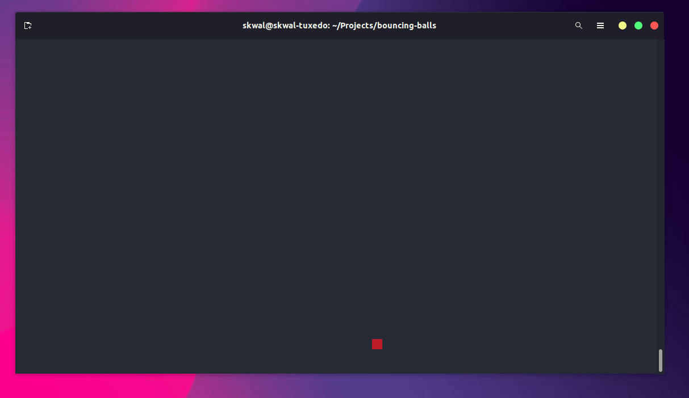
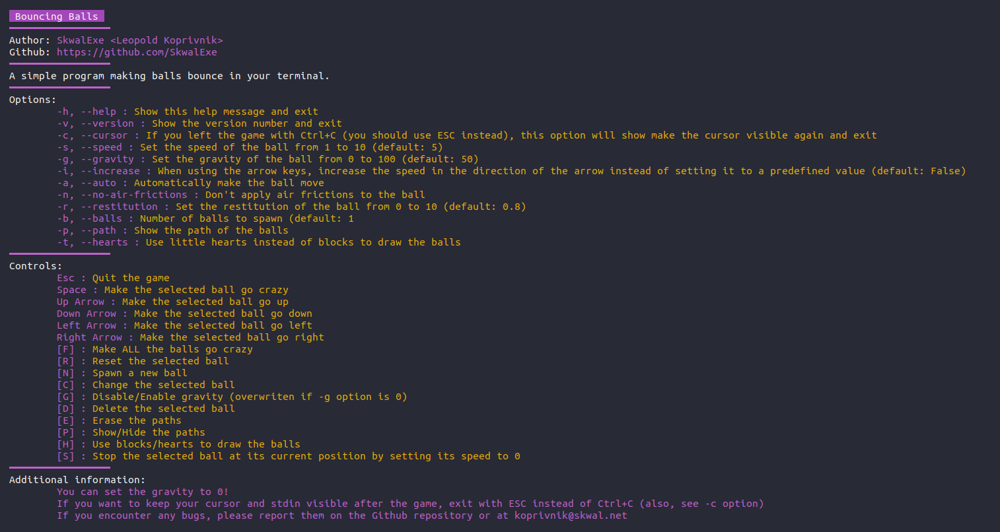
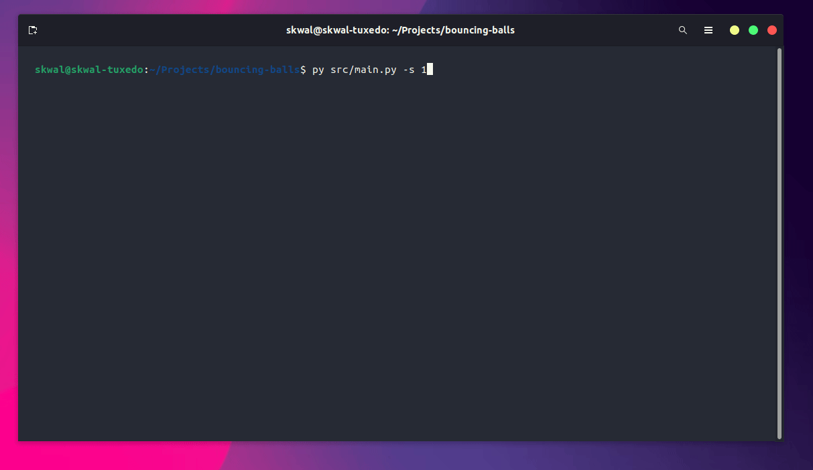
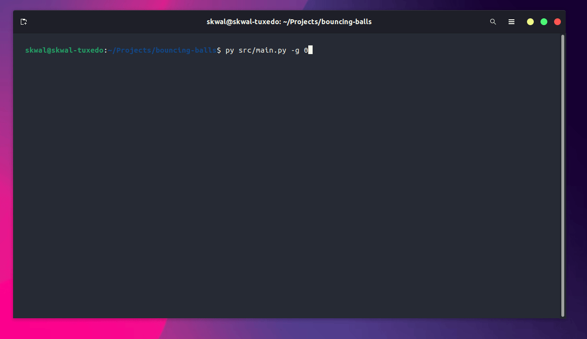
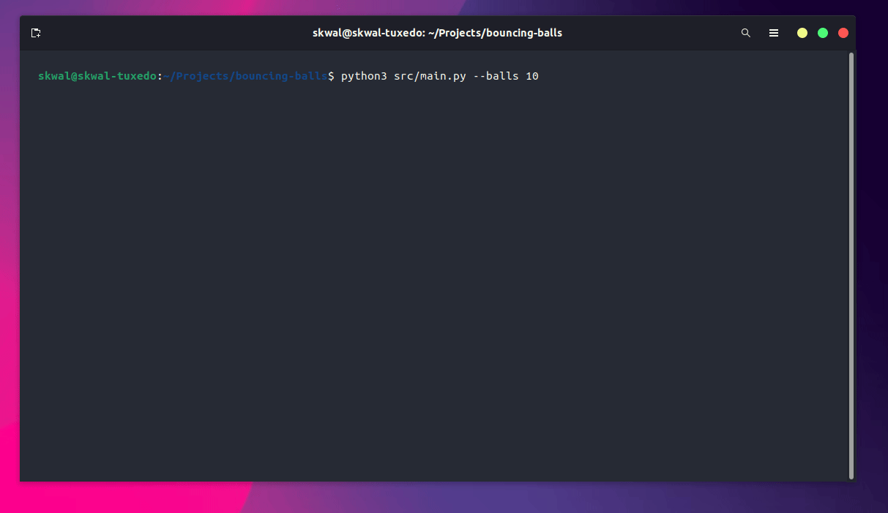
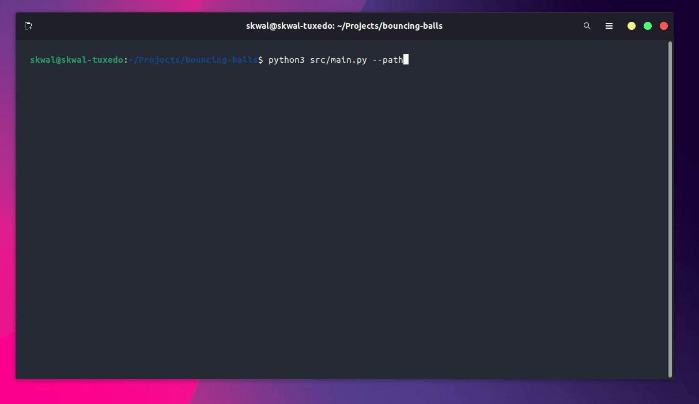
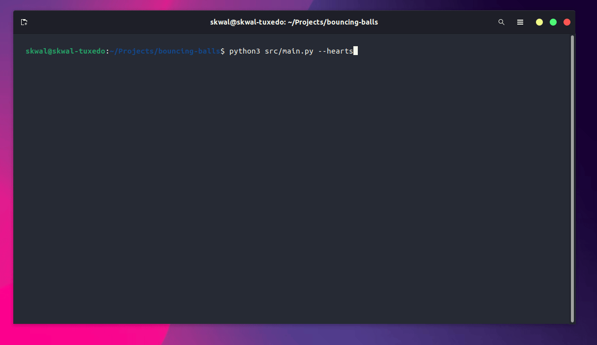

# Bouncing balls 🏀

This is a highly customizable application that simulates one or more bouncing balls in your terminal.



# Installation

First, clone this repository and `cd` into it:

```bash
git clone https://github.com/SkwalExe/bouncing-balls.git
cd bouncing-balls
```

Then, install the dependencies:

```bash
pip install -r requirements.txt
```

Finally, launch the game with python
    
```bash
python3 src/main.py
```

# Usage



## Changing the speed

Example with : 

```bash
# Slow
python3 src/main.py --speed 1
# Fast
python3 src/main.py --speed 10
```




## Changing the gravity

> You can also toggle the gravity with the [G] key

Example with : 

```bash
# No gravity
python3 src/main.py --gravity 0
# Normal gravity
python3 src/main.py --gravity 50
```



## Spawning multiple balls

> You can also spawn a new ball with the [N] key

Example with : 

```bash
# Spawn 10 balls
python3 src/main.py --balls 10

# Spawn 100 balls
python3 src/main.py --balls 100
```



## Showing the path of the balls

> You can also toggle the paths with the [P] key and erase them with the [E] key

Example with : 

```bash
# Show the path of the balls
python3 src/main.py --path
```



## Using hearts instead of blocks

> You can also toggle the hearts with the [H] key

Example with : 

```bash
# Use hearts instead of blocks
python3 src/main.py --hearts
```



# Controls

- Esc : Quit the game
- Space : Make the selected ball "go crazy"
- Up Arrow : Make the selected ball go up
- Down Arrow : Make the selected ball go down
- Left Arrow : Make the selected ball go left
- Right Arrow : Make the selected ball go right
- [F] : Make ALL the balls "go crazy"
- [R] : Reset the selected ball
- [N] : Spawn a new ball
- [C] : Change the selected ball
- [G] : Disable/Enable gravity (overwriten if -g option is 0)
- [D] : Delete the selected ball
- [E] : Erase the paths
- [P] : Show/Hide the paths
- [H] : Use blocks/hearts to draw the balls
- [S] : Stop the selected ball at its current position by setting its speed to 0


# final

If you have any problem, dont hesitate to open an issue.

# contributing

Pull requests are welcome. For major changes, please open an issue first to discuss what you would like to change.    